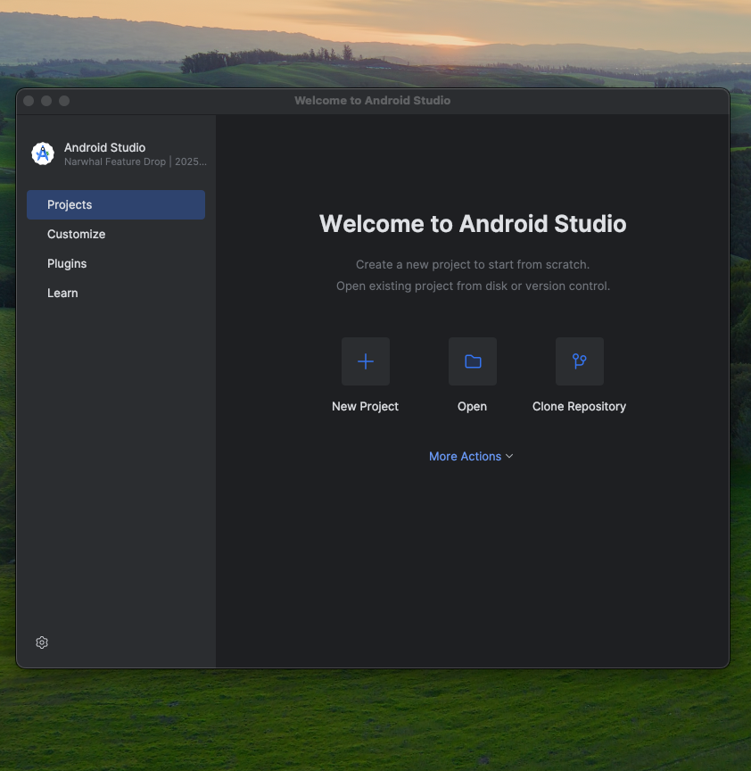
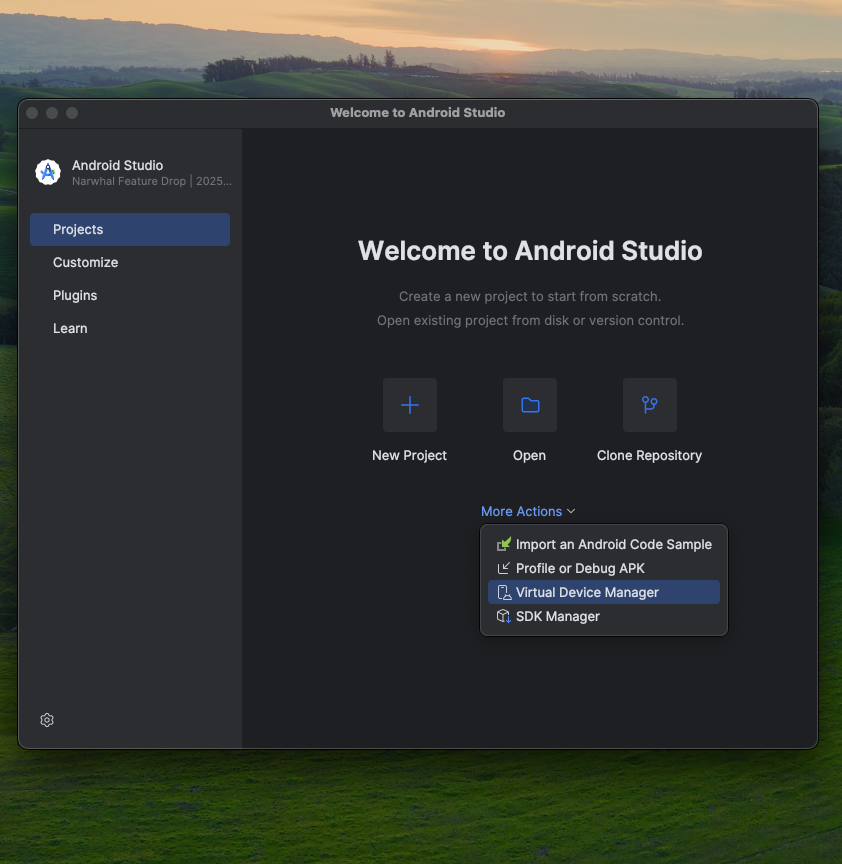
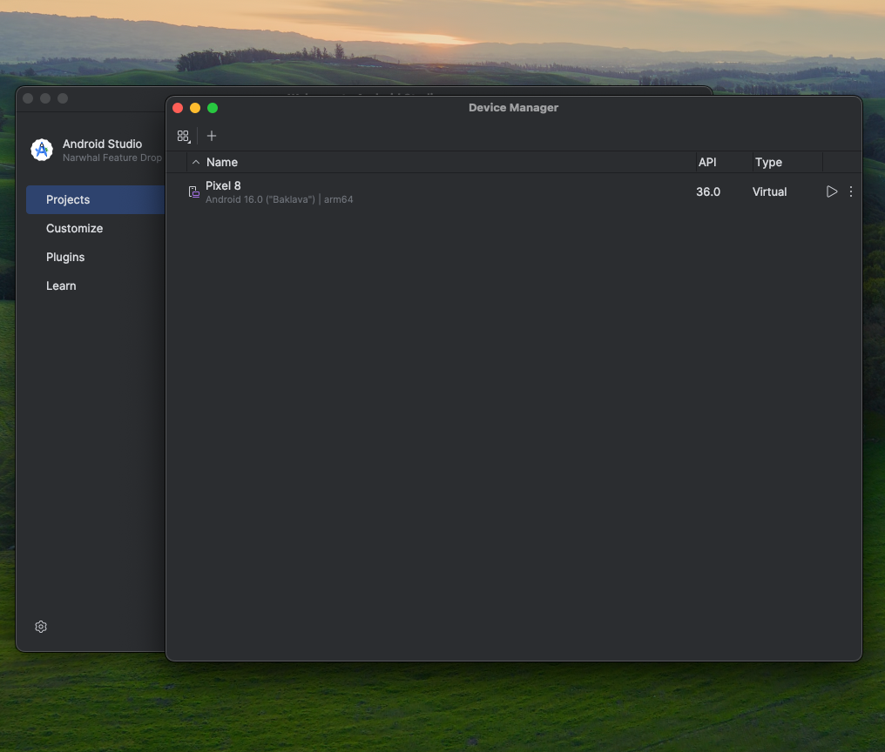

# Mobil-emergqr-app

## Aplicacion Mobil de EmergQR esta aplicacion es la mas importante de la empresa ya que representa el punto de entrada, registro y validacion de los clientes

## Arquitectura

### La arquitectura de se basa sobre arquitectura limpia con next.js React-Native

### Estructura

    ```
     emergqr-app/
     ├── src/
     │   ├── assets/ # Imagenes, Logos y demas.
     │   │  └── fonts/
     │   │  └── fonts/
     │   ├── components/ # Componentes reutilizables (botones, inputs, etc.)
     │   ├── constants/ # Colores, estilos, etc.
     │   ├── contexts/ # Contexto de React (Tema, Autenticación, etc.)
     │   ├── hooks/ # Hooks personalizados
     │   ├── locales/ # Archivos de traducción (en.json, es.json)
     │   ├── navigation/ # Lógica de navegación
     │   ├── Interfaces/ # Interfaces
     │   ├── screens/ # Pantallas principales de la app
     │   ├── services/ # Servicios (configuración de i18n, API, etc.)
     │   ├── store/ # Archivos de estado (Redux)
     │   ├── types/ # Tipos de datos personalizados
     │   └── utils/ # Funciones y utilidades
     ├── test/ # archivoos de pruebas unitarias y de integración
     │    ├── auth/ # de auth
     │    ├── client/ # de clients
     │    └──jest.moks.js # archivos de mocks
     ├── docs/ # Archivos de documentación
     ├── Readme_images imagenes de documentación
     ├── .editorconfig # Archivo de configuración de editor de código
     ├── App.tsx # Punto de entrada principal
     ├── App.json # Configuración de la app
     ├── index.ts # Archivo principal de configuración de TypeScript
     ├── .env # archivos de variables de ambientes de desarrollo
     ├── .env.test # archivos de variables de ambientes de test
     ├── .env.production # archivos de variables de ambientes de Produccion
     ├── .eslintrc.js # Archivo de configuración de ESLint
     ├── .gitignore # Archivos ignorados en el repositorio de Git
     ├── .prettierrc.js # Archivo de configuración de Prettier
     ├── babel.config.js # Archivo de configuración de Babel
     ├── jest.config.ts # Archivo de configuración de Jest
     ├── package-lock.json # Archivo de bloqueo de paquetes
     ├── package.json # Archivo de configuración de paquetes
     ├── tsconfig.json # Archivo de configuración de TypeScript
     ├── README.md documento tecnico de la app
     └──... (otros archivos de configuración)

### Tecnologias utilizadas

React Native

## instalar android estudio en su ultima version

### JetBrains te permite instalarlo desde su site o puedes instalar las herramientas JEtBrains ToolBox ahi dentro esta Android estudio

## Forma de arrancas el software

1. Debes bajar el código de sde gir https://github.com/emergqr/mobil

2. Para Cargar las dependencias
   ```
    Npm install
   ```
3. Mientras debes levantar el back end que tienes sus propias instrucciones para poderlo usar

4. Debes iniciar Android estudio en las siguinetes imagenes esta la secuencia de arranque del simulador secuencia de imagenes
   1. 
   2. 
   3. 
   4. 
   5. 

5. Luego se ejecuta el siguiente comando

```
npx expo start --clear
npx expo start -c

matar procesoso
lsof -i :8051
kill 12345
kill -9 12345
```
